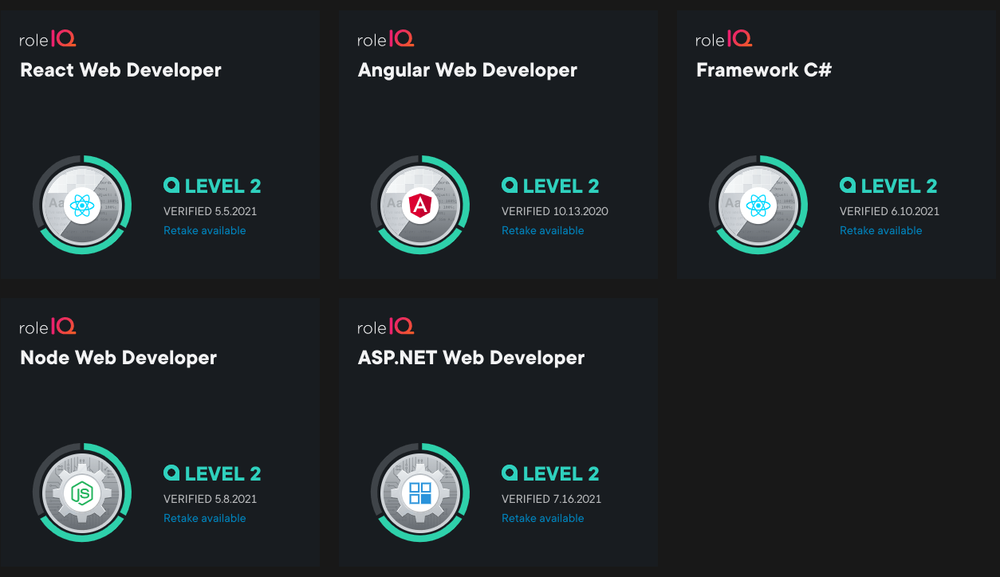

### Languages
- C#, CSS, GraphQL, HTML, JavaScript, Python, R, Ruby, SQL, T-SQL, TypeScript

### Frameworks
- Angular, Bootstrap, Express, .NET Core, Next

### Libraries / APIs
-  D3, jQuery, Lodash, Mongoose, Node, Pandas, Ramda, React, Redux

### Storage
- MongoDB, SQLite

### Testing

- Chai, Cypress, Jest, Mocha, Jasmine, React Testing Library, Supertest, Vitest 
