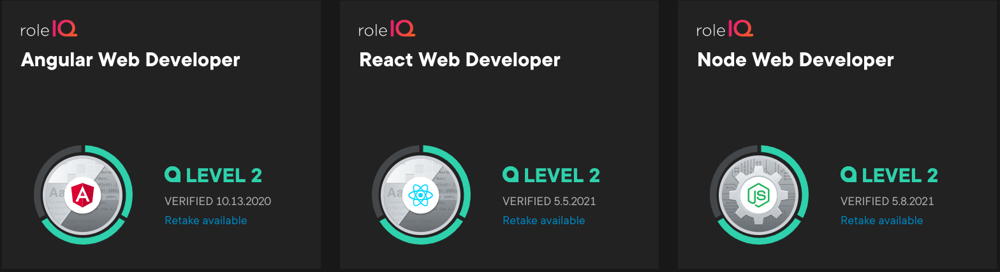

### Languages
- HTML, CSS, JavaScript, TypeScript, C#, Python, Ruby, R 

### Frameworks
- React, Angular, Bootstrap, .NET Core, Express

### Libraries / APIs
- Node, jQuery, Pandas, Lodash, Ramda, D3, Redux, Mongoose

### Storage
- T-SQL, SQLite, MongoDB
